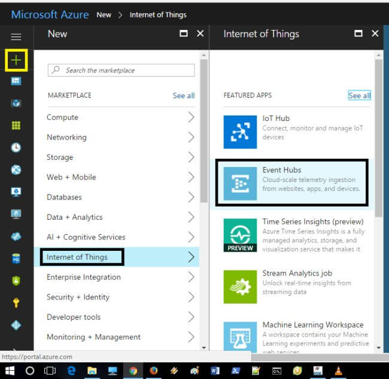
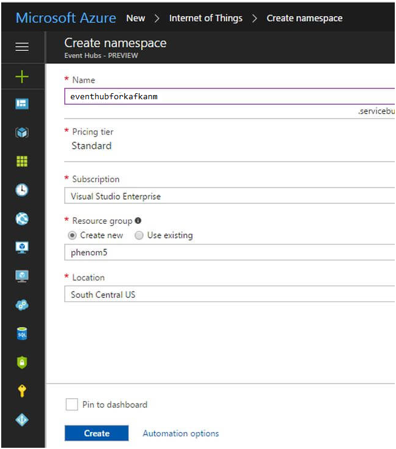
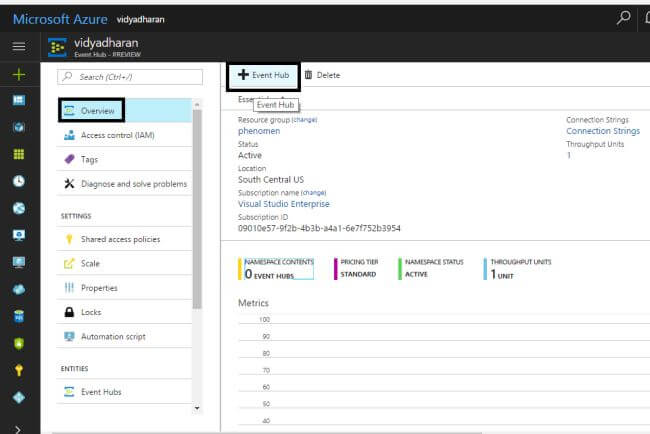
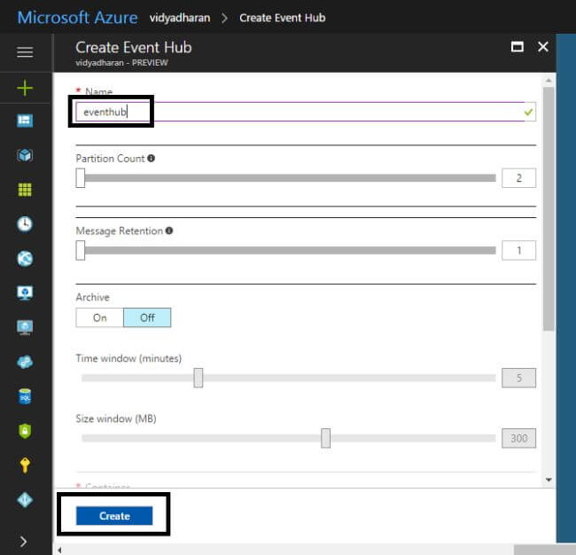
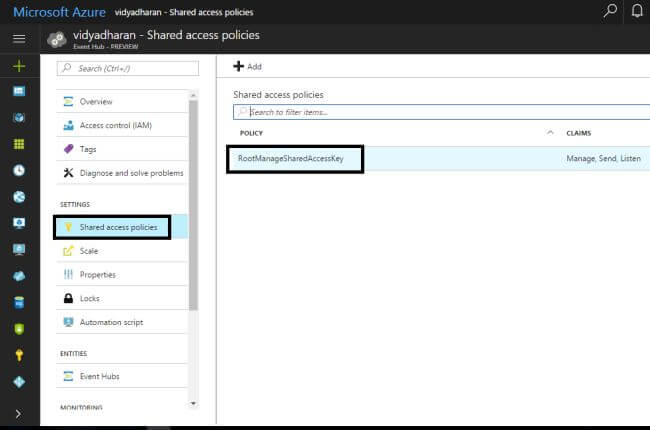
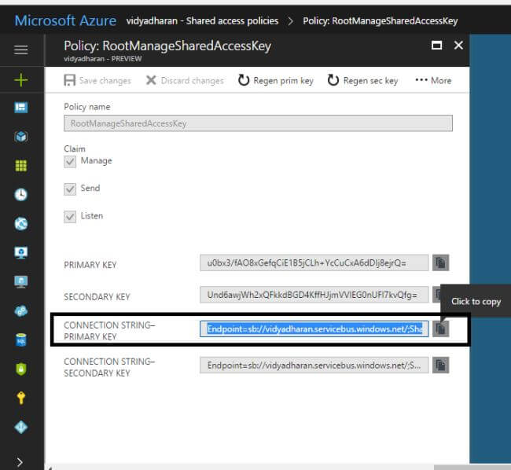
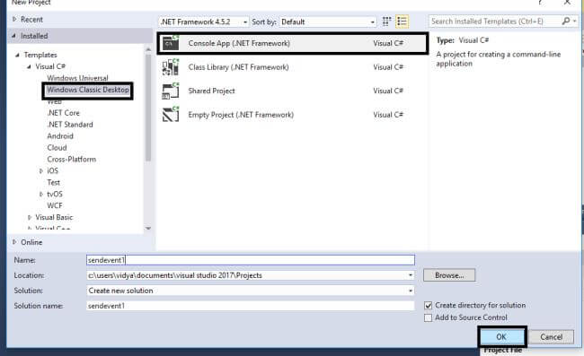
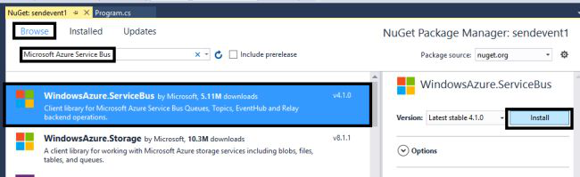
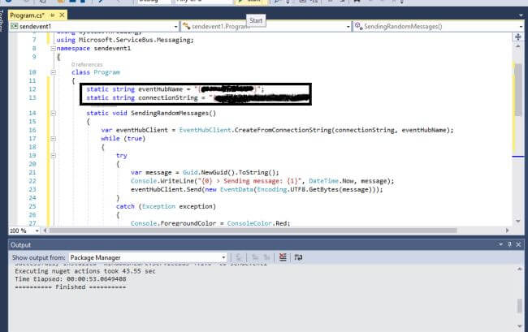
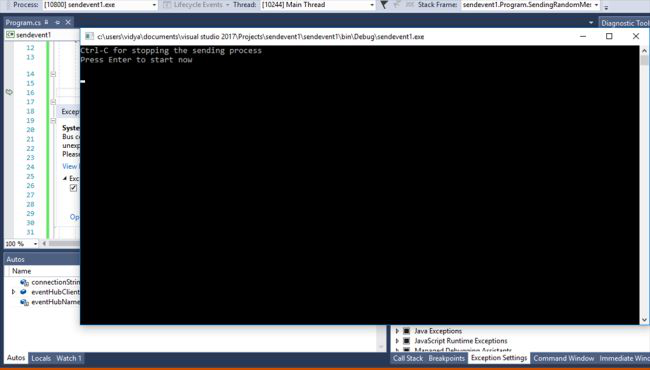

#################################
Azure EventHub – Introduction
#################################

In this article, I will explain about sending the events to Event Hubs in Azure using .NET framework. The Event Hubs has the capacity of processing and storing the data in data streaming platform and can process millions of processes per second with low latency. It also acts as a ramp for big data.

Sending the events to Event Hubs
----------------------------------

Before proceeding to send the events to the Event Hubs in Azure, we need to create a Event Hub so that we can send the events to it.

Step 1
======

Log into Azure portal.

Step 2
=======

Click New -> Internet of Things -> Event Hubs.

   
Step 3
=======

Now, we need to configure some basic settings, provide a name for the namespace, create a resource group with the location of the datacenter, and click "Create".

Step 4
=======

From the namespace blade that we created, click Overview -> Event Hub.

   
Step 5
=======

Provide a name for the Event Hub and click "Create".

Step 6
======

Select the created new event hub name from the list of the Event Hubs.

Step 7
======

Click "Shared access policies" and select "RootManagerSharedAccessKey".

Step 8
=======

Now, we need to backup a copy of the primary key and click Copy button in RootManageSharedAccessKey to clipboard.

Step 9
=======

Now, the event hub is created. For sending the events to the Azure, open Visual Studio 2017.

Step 10
=======

Click New -> Windows Classic Desktop -> Console App (.NET Framework) and click OK.

Step 11
========

The event hub process needs to be added with NuGet packages and right click Project.

Step 12
========

Click -> Manage NuGet Packages -> and in the Browse tab, search for MicrosoftAzureServiceBus. Click "Install".

Step 13
========

Some of the following using statements must be added to the program files.

.. code-block:: bash

   using System.Threading;  
   using Microsoft.ServiceBus.Messaging;   

Step 14
========

Again, add the following values to the event hub and to the namespace connection string. Replace the event hub name and connection string that has been created in Azure portal. 

.. code-block:: bash

   static string eventHubName = "{Event Hub name}";  
   static string connectionString = "{send connection string}";   

Step 15
========

The below mentioned methods should also be added to the class of the program. 

.. code-block:: bash

    static void SendingRandomMessages() {  
           var eventHubClient = EventHubClient.CreateFromConnectionString(connectionString, eventHubName);  
           while (true) {  
               try {  
                    var message = Guid.NewGuid().ToString();  
                    Console.WriteLine("{0} > Sending message: {1}", DateTime.Now, message);  
                    eventHubClient.Send(new EventData(Encoding.UTF8.GetBytes(message)));  
               } catch (Exception exception) {  
                   Console.ForegroundColor = ConsoleColor.Red;  
                         Console.WriteLine("{0} > Exception: {1}", DateTime.Now, exception.Message);  
                         Console.ResetColor();  
                     }  
                     Thread.Sleep(200);  
                }  
            }   
            
Step 16
=======

Add the following commands to the main method of the program structure. 

.. code-block:: bash
   
   Console.WriteLine("Press Ctrl-C to stop the sender process");  
   Console.WriteLine("Press Enter to start now");  
   Console.ReadLine();  
   SendingRandomMessages();   

   
Final code will looks like;

.. code-block:: code

   using System.Threading;
   using Microsoft.ServiceBus.Messaging;
   using System;
   using System.Text;

   namespace ConsoleApp1
   {
       class Program
       {
           static void Main(string[] args)
           {
               Console.WriteLine("Press Ctrl-C to stop the sender process");
               Console.WriteLine("Press Enter to start now");
               Console.ReadLine();
               SendingRandomMessages();
           }
           static void SendingRandomMessages()
           {
               string eventHubName = "eventhubforkafka";
               string connectionString = "Endpoint=sb://eventhubforkafkanm2.servicebus.windows.net/;SharedAccessKeyName=RootManageSharedAccessKey;SharedAccessKey=MvFtcDUY6ZzcvHhcXFLtlS4Dhmv0TS0GqeYExP/wz/Q=";
               int iCount = 0;
               var eventHubClient = EventHubClient.CreateFromConnectionString(connectionString, eventHubName);
               while (true)
               {
                   try
                   {
                       iCount = iCount + 1;
                       var message = "Message : " + iCount + " " +Guid.NewGuid().ToString();
                       System.Console.WriteLine("{0} > Sending message: {1}", DateTime.Now, message);
                       eventHubClient.Send(new EventData(Encoding.UTF8.GetBytes(message)));
                   }
                   catch (Exception exception)
                   {
                       Console.ForegroundColor = ConsoleColor.Red;
                       Console.WriteLine("{0} > Exception: {1}", DateTime.Now, exception.Message);
                       Console.ResetColor();
                   }
                   Thread.Sleep(200);
               }
           }
       }
   }

Step 17
=======

Press F5 or run the console application. We have sent the messages to the event hub.

Step 18
=======

How to Read Messages from Azure Event Hub

- Add library ‘com.microsoft.azure:azure-eventhubs-spark_2.11:2.3.2’ using Maven to Cluster created in Databricks
- Code for readsteram 

.. code-block:: code

  import org.apache.spark.eventhubs._

   // Build connection string with the above information
   val connectionString = ConnectionStringBuilder("<Connection String>")
     .setEventHubName("<Event Hub Name>")
     .build

   val customEventhubParameters =
     EventHubsConf(connectionString)
     .setMaxEventsPerTrigger(5)

   val incomingStream = spark.readStream.format("eventhubs").options(customEventhubParameters.toMap).load()

- Get the ouput in Console 

.. code-block:: code

   import org.apache.spark.sql.types._
   import org.apache.spark.sql.functions._

   // Event Hub message format is JSON and contains "body" field
   // Body is binary, so we cast it to string to see the actual content of the message
   val messages =
     incomingStream
     .withColumn("Offset", $"offset".cast(LongType))
     .withColumn("Time (readable)", $"enqueuedTime".cast(TimestampType))
     .withColumn("Timestamp", $"enqueuedTime".cast(LongType))
     .withColumn("Body", $"body".cast(StringType))
     .select("Offset", "Time (readable)", "Timestamp", "Body")

   messages.printSchema

   messages.writeStream.outputMode("append").format("console").option("truncate", false).start().awaitTermination()
