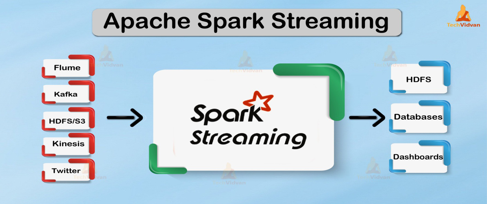
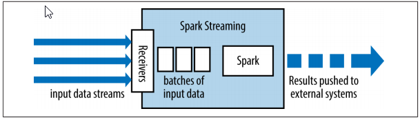
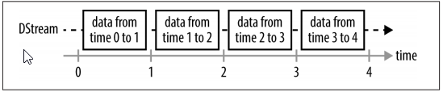

###################
Spark Streaming
###################

What Is Stream Processing
--------------------------

Spark Streaming is an extension of the core Spark API that enables scalable, high-throughput, fault-tolerant stream processing of live 
data streams. Data can be ingested from many sources like Kafka, Flume, Kinesis. Finally, processed data can be pushed out to filesystems
, databases, and live dashboards.

- Stream processing is the act of continuously incorporating new data to compute a result. 
- In stream processing, the input data is unbounded and has no predetermined beginning or end.
- It simply forms a series of events that arrive at the stream processing system (e.g., credit card transactions, clicks on a website, or sensor readings from Internet of Things [IoT] devices).
- User applications can then compute various queries over this stream of events (e.g., tracking a running count of each type of event or aggregating them into hourly windows).
- Naturally, we can compare streaming to batch processing, hence uses a “micro-batch” architecture.

Stream Processing Use Cases
----------------------------

- Notifications and alerting 
- Real-time reporting
- Incremental ETL 
- Real-time decision making 
- Online machine learning 

Advantages of Stream Processing
--------------------------------

- First, stream processing enables lower latency When your application needs to respond quickly (on a timescale of minutes, seconds, or milliseconds), you will need a streaming system that can keep state in memory to get acceptable performance. 
- Second, stream processing can also be more efficient in updating a result than repeated batch jobs.If we want to compute web traffic statistics over the past 24 hours, a naively implemented batch job might scan all the data each time it runs, always processing 24 hours’ worth of data. In contrast, a streaming system can remember state from the previous computation and only count the new data

Spark Streaming Architecture 
-----------------------------

   
- Spark Streaming receives data from various input sources and groups it into small batches. 
- New batches are created at regular time intervals. 
- At the beginning of each time interval a new batch is created, and any data that arrives during that interval gets added to that batch. 
- At the end of the time interval the batch is done growing. The size of the time intervals is determined by a parameter called the batch interval. 
- Each input batch forms an RDD, and is processed using Spark jobs to create other RDDs. The processed results can then be pushed out to external systems in batches. 

   
- Programming abstraction in Spark Streaming is a discretized stream or a DStream, which is a sequence of RDDs, where each RDD has one time slice of the data in the stream
- You can create DStreams either from external input sources, or by applying transfor‐ mations to other Dstreams 

Core Concepts
-------------

- Input Sources
- Sinks
- Output modes
- Watermarks
- Check-pointing 

Input Sources
--------------

Structured Streaming supports several input sources for reading in a streaming fashion. As of Spark 2.2, the supported input sources are as follows:

- Socket (for testing)
- Stream of files
- Apache Kafka 
- Apache Flume

Sinks
------

- As Input sources allow you to get data into Structured Streaming, sinks specify the destination for the result set of that stream. 
- Sinks and the execution engine are also responsible for reliably tracking the exact progress of data processing. Here are the supported output sinks as of Spark 2.2:
   
   i) Apache Kafka 0.10 
   
   ii) Almost any file format 
  
   iii) A foreach sink for running arbitary computation on the output records 
 
   iv) A console sink for testing 
  
   v) A memory sink for debugging 

Output Mode
------------

- Output Mode : to define how we want Spark to write data to sink
- The supported output modes are as follows: 

   i) Append (only add new records to the output sink) 
 
   ii) Update (update changed records in place) 

   iii) Complete (rewrite the full output) 
